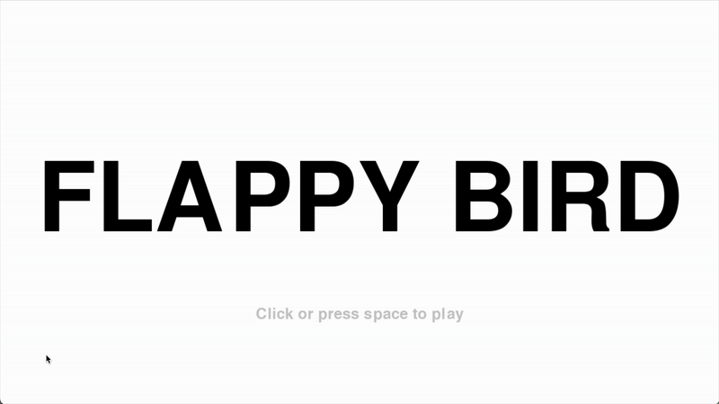

# Pygame Flappy Bird
A Python implementation of Flappy Bird using Pygame.

## Demo

## Usage
1. Install dependencies: `pip install -r requirements.txt`
2. Run `main.py` to start the game.
3. Press **Space** or **mouse click** to jump, **F** to toggle fullscreen, and **R** to reset the display size. 
